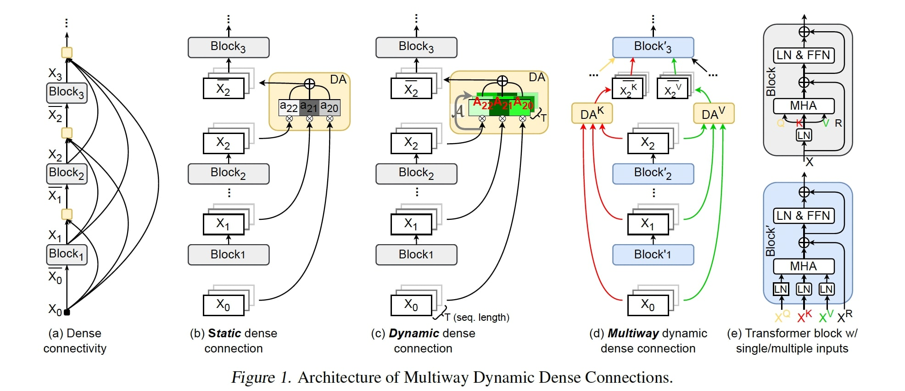

# MUDDFormer

This repository contains the code in both PyTorch and Jax for our paper.

> [**MUDDFormer: Breaking Residual Bottlenecks in Transformers via Multiway Dynamic Dense Connections**](https://arxiv.org/abs/2502.12170)\
> Da Xiao, Qingye Meng, Shengping Li, Xingyuan Yuan

## About

We propose <strong>MU</strong>ltiway <strong>D</strong>ynamic <strong>D</strong>ense (<strong>MUDD</strong>) connections, a simple yet effective method to address the limitations of residual connections and enhance cross-layer information flow in Transformers. Unlike existing dense connection approaches with static and shared connection weights, MUDD generates connection weights dynamically depending on hidden states at each sequence position and for each decoupled input stream (the query, key, value or residual) of a Transformer block. MUDD connections can be seamlessly integrated into any Transformer architecture to create MUDDFormer. Extensive experiments show that MUDDFormer significantly outperforms Transformers across various model architectures and scales in language modeling, achieving performance of Transformers trained with 1.8x--2.4x compute. Notably, MUDDPythia-2.8B matches Pythia-6.9B in pretraining ppl and downstream tasks and even rivals Pythia-12B in five-shot settings, while adding only 0.23% parameters and 0.4% computation.

In practice, we train MUDDFormer on TPU for efficiency and then infer on GPU for convenience, so we open-source Jax training code and PyTorch inference code in two separate folders. 

## Jax 

- The source code is in the `jax/` folder, supporting train MUDDFormer on TPU or GPU with [google/MaxText](https://github.com/google/maxtext).
- Please refer to `jax/README.md` for details.

## PyTorch

- The source code is in the `pytorch/` folder, supporting accelerated inference with *torch.compile*.
- We also uploaded pretrained [MUDDFormer-2.8B](https://huggingface.co/Caiyun-AI/MUDDFormer-2.8B), [MUDDPythia-1.4B](https://huggingface.co/Caiyun-AI/MUDDPythia-1.4B) and [MUDDPythia-2.8B](https://huggingface.co/Caiyun-AI/MUDDPythia-2.8B) to Huggingface🤗. 
- Please refer to `pytorch/README.md` for details.
