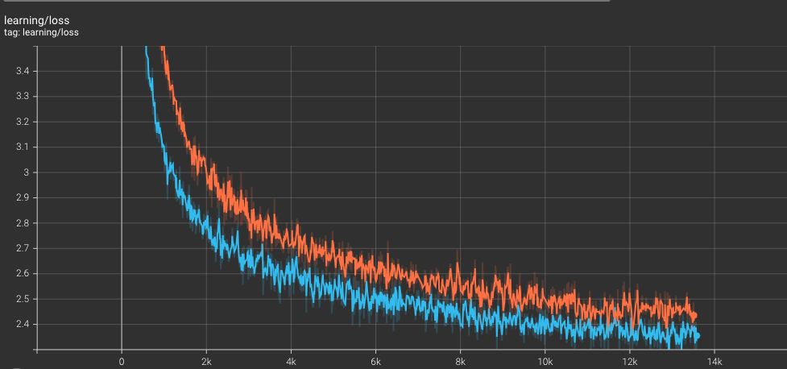

## Introduction
This directory contains our jax implementation of MUDDFormer. Note that our state-of-the-art results reported in the paper were obtained by training the model on a large-scale TPU cluster.

In addition, the code of this library is modified based on [google/MaxText](https://github.com/google/maxtext) (thanks to google for its contribution), and most of its parameters and functions are used. At the same time, for the sake of simplicity of the code, some that are not used in our article are also removed. For the using of more functions, please refer to the [google/MaxText](https://github.com/google/maxtext) library

## Environment
```plaintext
python==3.10.10  
jax==0.4.35
``` 

### Table of Contents
- [Getting Started](#Getting-started)
    - [1. Data Preparation](#1-Data-Preparation)
    - [2. Clone Library](#2-clone-Library)
    - [3. Create TPU](#3-Create-TPU)
    - [4. Install](#4-Install)
    - [5. Train On Different Hardware](#5-Train-On-Different-Hardware)
- [Use Your Dataset](#Use-Your-Dataset)
- [Tensorboard](#Tensorboard)
- [Experiments](#Experiments)
    - [410M MUDDFormer Vs Transformer++](#410m-muddformer-vs-transformer)
    - [Other Results](#Other-Results)

## Getting Started

#### 1. Data Preparation
Data is handled entirely by reference to the Pythia Library, We chose [pythia_pile_idxmaps](https://huggingface.co/datasets/EleutherAI/pythia_pile_idxmaps) as the raw data, not [pythia_deduped_pile_idxmaps](https://huggingface.co/datasets/EleutherAI/pythia_deduped_pile_idxmaps). Interested can refer to its method for production. To save you time, we also open source the [tfrecord dataset](https://huggingface.co/datasets/Caiyun-AI/Pile_tfrecord/tree/main) we've processed.


#### 2. Clone Library
```bash
git clone https://github.com/Caiyun-AI/MUDDFormer.git
```
#### 3. Create TPU
 
```bash
# v3 create command
gcloud alpha compute tpus tpu-vm create $TPU_NAME --zone=$ZONE --accelerator-type=$TPU_TYPE --version=tpu-vm-base --project=$PROJECT_ID  --scopes=https://www.googleapis.com/auth/cloud-platform --preemptible

# v4 create command
gcloud alpha compute tpus tpu-vm create $TPU_NAME --zone=$ZONE --accelerator-type=$TPU_TYPE --version=tpu-vm-tf-2.10.0-pod-v4 --project=$PROJECT_ID  --scopes=https://www.googleapis.com/auth/cloud-platform --preemptible

# v5p create command
gcloud alpha compute tpus queued-resources create $TPU_NAME --node-id $TPU_NAME  --project $PROJECT_ID   --zone=$ZONE   --accelerator-type=$TPU_TYPE --runtime-version v2-alpha-tpuv5 --service-account $SERVICE_ACCOUNT   --best-effort
```
*```SERVICE_ACCOUNT```*: &nbsp;it can be obtained through command &nbsp; ```gcloud iam service-accounts list```. The result is similar to: ```***@developer.gserviceaccount.com```   
*```TPU_NAME```*:&nbsp;tpu name  
*```TPU_TYPE```*:&nbsp;tpu type, v3-8, v3-32, v4-8, v4-32, v5p-8, v5p-32 etc.    
*```PROJECT_ID```*: your project id  
*```--preemptible/best-effort```*:&nbsp;if you don't want to create a preemption, you can remove this parameter  

#### 4. Install

```bash
pip install -r requirements_tpu.txt  # for tpu
pip install -r requirements_gpu.txt   # for gpu
```

#### 5. Train On Different Hardware
- **Train on TPU**
```bash
PROJECT_ID=... # your tpu project id
TPU_NAME=...  # tpu name
ZONE=... # tpu zone
PIP_OR_PYTHON_PATH=...  # python or pip bin dir
WORKDIR=... # worddir
RUN_NAME=... # checkpoint and tensorboard save, it can be local dir or bucket dir(gs://...)
DATASET_PATH=... # dataset path
MODEL_NAME=... # train model class name, such as MUDDLlama2Medium, Llama2Medium
gcloud compute tpus tpu-vm ssh $TPU_NAME --zone=$ZONE --worker=all --command="export HARDWARE=tpu; cd $WORKDIR; $PIP_OR_PYTHON_PATH/python MaxText/train.py MaxText/configs/base_v2.yml run_name=$RUN_NAME dataset_path=$DATASET_PATH  model_name=$MODEL_NAME 2>&1| tee train.log" --project=$PROJECT_ID
```

- **Example on TPU**

```bash
PROJECT_ID=xx
TPU_NAME=xx
ZONE=us-east1-d
PIP_OR_PYTHON_PATH=/home/xxx/python
WORKDIR=/home/xxx/projects/muddformer/jax/
RUN_NAME=$WORKDIR/output/
DATASET_PATH=/data/
MODEL_NAME=MUDDLlama2Medium
gcloud compute tpus tpu-vm ssh $TPU_NAME --zone=$ZONE --worker=all --command="export HARDWARE=tpu; cd $WORKDIR; $PIP_OR_PYTHON_PATH/python MaxText/train.py MaxText/configs/base_v2.yml run_name=$RUN_NAME dataset_path=$DATASET_PATH  model_name=$MODEL_NAME hardware=tpu 2>&1| tee train.log" --project=$PROJECT_ID
```

- **Train on GPU**
```bash
export HARDWARE=gpu # gpu or tpu
PROJECT_ID=... # your tpu project id
TPU_NAME=...  # tpu name
ZONE=... # tpu zone
PIP_OR_PYTHON_PATH=...  # python or pip bin dir
WORKDIR=... # worddir
RUN_NAME=... # checkpoint and tensorboard save, it can be local dir or bucket dir(gs://...)
DATASET_PATH=... # dataset path
MODEL_NAME=... # train model class name, such as MUDDLlama2Medium, Llama2Medium
$PIP_OR_PYTHON_PATH/python MaxText/train.py MaxText/configs/base_v2.yml run_name=$RUN_NAME dataset_path=$DATASET_PATH  model_name=$MODEL_NAME compile_topology_num_slices=1 2>&1| tee train.log" --project=$PROJECT_ID
```

- **Example on GPU**
```bash
PIP_OR_PYTHON_PATH=/home/xxx/python
WORKDIR=/home/xxx/projects/muddformer/jax/
RUN_NAME=$WORKDIR/output/
DATASET_PATH=/data/
MODEL_NAME=MUDDLlama2Medium
$PIP_OR_PYTHON_PATH/python MaxText/train.py MaxText/configs/base_v2.yml run_name=$RUN_NAME dataset_path=$DATASET_PATH  model_name=$MODEL_NAME =1 hardware=gpu compile_topology_num_slices=1 2>&1| tee train.log"
```

## Use Your Dataset

You can change it to your own dataset by modifying the parameters ```dataset_path``` and ```dataset_type``` in the ```.yml``` config file (default dataset is ```pile```). Meanwhile, you need add the corresponding data processing files or functions to the file input_pipeline directory. For detail, you can view function [ create_data_iterator_with_tokenizer](https://github.com/Caiyun-AI/MUDDFormer/blob/08bbebc916480f5295871c115d357310a3dcc8f2/jax/MaxText/input_pipeline/input_pipeline_interface.py#L228) in ```input_pipeline_interface.py```

## Tensorboard

The train results include ```loss```、```grad norm```、```learning rate```etc message are writed tensorboard dir(default in $RUN_NAME/tensorboard). You can run a tensorboard program on local machine. such as:
    
```bash
tensorboad --logdir $RUN_NAME/tensorboard --bind_all --port 60000
```
You can view training-related information by visiting the URL （the IP + port of the machine you are running tensoboard on） after successful run
    
## Experiments

#### **410M MUDDFormer Vs Transformer++**

蓝线：MUDDFormer with prepostnorm

橘线：Transformer++



#### **Other Results**

See article for details.😄

